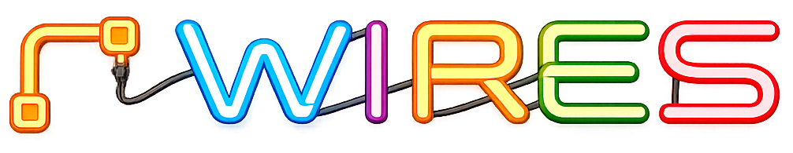

  

# Wires

**Wires is an AV signal flow and wiring diagram application for audio, video, lighting and network workflows.**

Design, document and share professional technical installations using recognizable equipment images, physical connection ports, real cable paths and complete animated signal routes.

[Visit the Wires website](https://alkoda-wires.com) ·
[Try Wires online](https://alkoda-wires.com/try-it.html) ·
[Download Wires](https://alkoda-wires.com/downloads.html)

## Main features

- Place devices freely on a large visual canvas
- Import real equipment images or use geometric shapes
- Crop images and remove their backgrounds
- Add physical inputs and outputs directly to device images
- Create custom device categories, colors and cable families
- Draw and adjust real cable paths with 90-degree bends
- Group equipment into zones for rooms, racks, stages or technical areas
- Navigate large projects with zoom, panning and a minimap
- Filter plans by device category, cable type or zone
- Generate an exportable connection and patch list

## Animated signal routes

Group several cables into one complete logical signal route.

- Follow a signal from source to destination
- Animate the direction of the signal
- Trace signals through converters, switches, interfaces, racks and displays
- Identify missing or incorrect connections
- Explain complex systems clearly to technicians, operators and clients

## Projects and sub-projects

- Save and reopen projects locally
- Import existing Wires projects
- Copy, cut and paste multiple devices
- Build reusable technical layouts
- Import projects as sub-projects with Wires Pro
- Work without depending on a cloud service

## Export and sharing

- Export the complete canvas as a PDF
- Export the connection list as a PDF
- Generate a standalone interactive HTML viewer
- Explore devices, descriptions, connections and routes in a web browser
- Animate signal routes in the exported HTML viewer
- Share documentation without requiring Wires to be installed

## Designed for

- Broadcast and live-production teams
- Streamers and content creators
- Audiovisual integrators
- Event and rental companies
- Churches and places of worship
- Conference and training rooms
- Studios and technical installations

## Free and Pro

Wires starts in Free mode.

### Free

- Up to 10 devices
- Canvas, cables, zones and text labels
- Signal routes and route animation
- Interactive HTML viewer
- Exportable connection list
- PDF export at 75 dpi

### Pro

- Unlimited devices
- Sub-projects
- PDF export from 75 to 600 dpi
- Activation on up to two computers
- One-time purchase

[Compare Free and Pro](https://alkoda-wires.com/licence.html)

## Supported platforms

- Windows
- macOS Apple Silicon
- macOS Intel
- Linux

## Languages

The application and its documentation are available in:

- English
- French
- Spanish

## Download

Download the latest version from the official Wires website:

**https://alkoda-wires.com/downloads.html**

Wires is developed independently by Alkoda.
